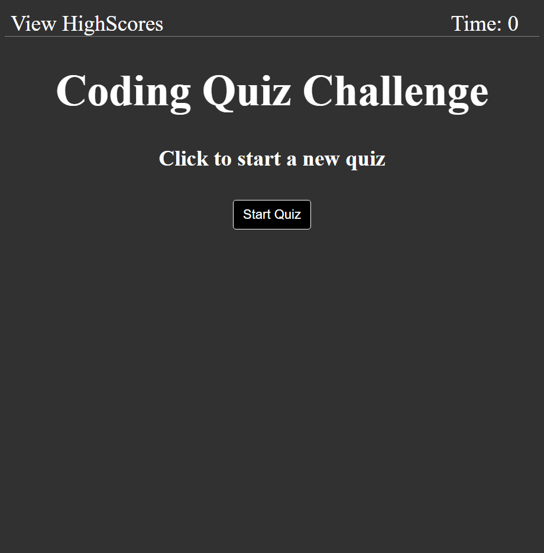

# quiz-app

Simple quiz web app project written in JS.

https://jonoaugustine.github.io/quiz-app/

---

This is a simple timed-quiz web-app written with dynamically added DOM elements
constructed in JS. It utilizes a basic framework
([see](https://github.com/JonoAugustine/quiz-app/blob/master/assets/js/extensions.js))
I wrote to make constructing and modifying element trees much simpler.

